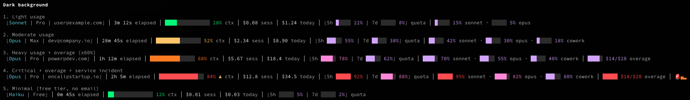
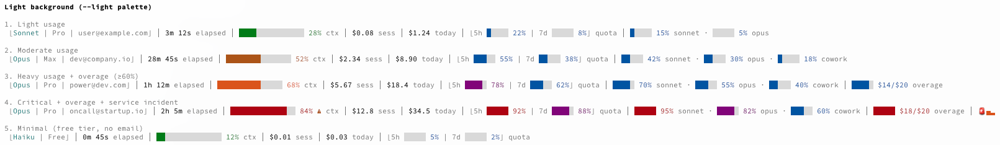

# ⚡ claudash

[](https://github.com/day0ops/claudash/actions/workflows/ci.yml)
[](LICENSE)

A rich status line for [Claude Code](https://docs.anthropic.com/en/docs/claude-code), written in Rust.

Displays model, subscription plan, email, session duration, context window usage, session and daily costs, quota utilization with per-model sub-bars, pay-as-you-go overage, and Claude service health — all in a compact, color-coded status bar.

## Example output

**Dark background:**



**Light background:**



**Segment breakdown:**

| # | Segment | Description | Example |
|---|---------|-------------|---------|
| 1 | **Identity** | Active model, plan, and email (from OAuth profile) | `[Opus \| Pro \| user@example.com]` |
| 2 | **Session duration** | Elapsed time for the current session | `12m 30s elapsed` |
| 3 | **Context window** | 15-char progress bar with 4 color zones (green 0–40%, yellow 41–60%, orange 61–warn%, red warn%+). Warning icon at auto-compaction threshold. | `███████████░░░░ 72% ⚠ ctx` |
| 4 | **Session cost** | Running USD cost for the current session | `$0.45 sess` |
| 5 | **Daily cost** | Accumulated spend across all sessions today | `$3.21 today` |
| 6 | **Quota** | Grouped 5-hour and 7-day quota utilization | `[5h ███░░ 55% \| 7d █░░░░ 13%] quota` |
| 7 | **Per-model sub-bars** | Individual 7-day quota bars per model tier | `██░░░ 35% sonnet · █░░░░ 12% opus` |
| 8 | **Overage** | Pay-as-you-go extra usage (shown at ≥60% of monthly limit) | `███░░ 🔥 $14/$20 overage` |
| 9 | **Service status** | Siren icon with severity bars when an incident is active | `🚨▄▂` |

## Installation

### Using Claude Code marketplace plugin (recommended)

1. Inside Claude Code, add the plugin marketplace and install:

```
/plugin marketplace add day0ops/claudash
/plugin install claudash@claudash
```

2. Run `/claudash:setup` inside Claude Code, this downloads the binary and configures your statusline
3. Restart Claude Code

### Pre-built binaries

1. Download the latest binary for your platform from [Releases](https://github.com/day0ops/claudash/releases)
2. Place it somewhere on your `PATH` (e.g. `/usr/local/bin/claudash`)
3. Make it executable: `chmod +x /usr/local/bin/claudash`
4. Continue to [Configuration](#configuration)

Available binaries:

| Platform | Architecture | Binary |
|----------|-------------|--------|
| Linux | x86_64 | `claudash-linux-amd64` |
| Linux | ARM64 | `claudash-linux-arm64` |
| macOS | x86_64 (Intel) | `claudash-darwin-amd64` |
| macOS | ARM64 (Apple Silicon) | `claudash-darwin-arm64` |
| Windows | x86_64 | `claudash-windows-amd64.exe` |
| Windows | ARM64 | `claudash-windows-arm64.exe` |

### From source

```sh
make install
```

Or without make:

```sh
cargo build --release
cp target/release/claudash /usr/local/bin/claudash
```

## Configuration

### 1. Add the status line command

Add to your Claude Code settings (`~/.claude/settings.json`):

```json
{
  "statusLine": {
    "type": "command",
    "command": "claudash"
  }
}
```

#### Optional flags

Customise the command with flags:

```json
{
  "statusLine": {
    "type": "command",
    "command": "claudash --cwd --git-branch"
  }
}
```

If you use a **light terminal background**, add `--light` for better contrast:

```json
{
  "statusLine": {
    "type": "command",
    "command": "claudash --light --cwd --git-branch"
  }
}
```

### 2. Restart Claude Code

For the status line to appear, **restart Claude Code** (or start a new session). The status line renders at the bottom of the terminal on every prompt.

### CLI flags

| Flag | Default | Description |
|------|---------|-------------|
| `--cwd` | off | Show last segment of current working directory |
| `--cwd-max-len N` | 30 | Truncate cwd to N characters |
| `--git-branch` | off | Show current git branch |
| `--git-branch-max-len N` | 30 | Truncate branch name to N characters |
| `--light` | off | Use darker color palette optimised for light terminal backgrounds |
| `--debug` | off | Write debug output to `/tmp/claudash-debug.log` |
| `--version` | — | Print version and exit |

## How it works

Claude Code pipes session JSON (model, cost, context window) to claudash via stdin. claudash enriches this with data from the Anthropic OAuth APIs (profile, quota, usage) and the Claude status page, then outputs a single ANSI-formatted line that Claude Code renders as the status bar.

All network requests are cached in `/tmp` with staggered TTLs so the status line stays fast. See [ARCH.md](ARCH.md) for a detailed architecture walkthrough.

## Credentials

claudash reads your Claude OAuth credentials to display your plan and fetch quota/profile data.

1. **macOS Keychain** — checked first (same location Claude Code uses)
2. **File fallback** — `~/.claude/.credentials.json`

If `CLAUDE_CONFIG_DIR` is set, both the Keychain service name and file path adjust accordingly (matching Claude Code's own behaviour).

## Caching

Network requests are cached in `/tmp` to keep the status line fast:

| Data | Cache TTL (success) | Cache TTL (failure) |
|------|---------------------|---------------------|
| Profile (email, org) | 1 hour | 5 minutes |
| Usage / quota | 60 seconds | 15 seconds |
| Service status | 2 minutes | 30 seconds |

Rate-limit responses from the usage API are respected via the `Retry-After` header.

## Environment variables

| Variable | Effect |
|----------|--------|
| `CLAUDE_CONFIG_DIR` | Override the Claude config directory (affects credential lookup and cache file naming) |
| `CLAUDE_AUTOCOMPACT_PCT_OVERRIDE` | Set the auto-compaction threshold (default: 85%) — context warning triggers 5% below this |

## Building

Requires Rust 2021 edition.

```sh
make check              # format check + lint + test
make release            # optimised binary with LTO and symbol stripping
make install            # build release + copy to /usr/local/bin
```

| Target | Description |
|--------|-------------|
| `make build` | Debug build |
| `make release` | Optimised release build |
| `make test` | Run unit tests |
| `make lint` | Run clippy lints |
| `make fmt` | Check formatting |
| `make fmt-fix` | Format code in place |
| `make check` | Full CI check (fmt + lint + test) |
| `make clean` | Remove build artifacts |
| `make install` | Build release and copy to `/usr/local/bin` |
| `make uninstall` | Remove from `/usr/local/bin` |

## Dependencies

- [`serde`](https://crates.io/crates/serde) / [`serde_json`](https://crates.io/crates/serde_json) — JSON parsing
- [`ureq`](https://crates.io/crates/ureq) — HTTP client for usage, profile, and status APIs

## License

[MIT](LICENSE)
